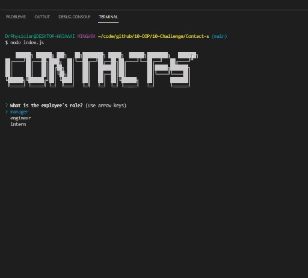

# Contact-s
A node.js application that builds a webpage of your professional contacts. Build without ever leaving your terminal!

  
  

  ## Description
  
  This package runs on node.js and generates a contact sheet for you in html. This application is designed to run entirely in your terminal.

  This project is built entirely using object oriented programming, and uses nothing but classes throughout. Its modules are broken down in the lib directory.
  Multiple tests were developed using jest while creating the modules, as test-driven development was a paradigm of this project.
  The brain of the operation is found in index.js which imports inquirer prompts from promptUser.js. As a consequence, this application relies heavily on promise resolution.

  The entire operation is designed to run in the background, while the user is unaware of the complexity under the hood.
  The code was designed to be utility-based so that future changes are easier to implement.

  [Link to Walkthrough Video](https://watch.screencastify.com/v/9Kk3T9CjCkV9giu7HULm)

  ## Table of contents

  * [Installation](#installation)
  * [Usage](#usage)
  * [Maintainers](#maintainers)
  * [Contributing](#contributing)
  * [Tests](#tests)
  * [Credits](#credits)
  * [License](#license)

  ## Installation
  First fork the project and clone the repository. Then in your CLI enter 'node install' to install all dependencies.

  This project requires Inquirer and jest as dependencies.

  ## Usage
  In the CLI enter 'node index.js' to initiate the application. You will be led through a series of prompts and once you have completed them your html file called 'employees.html' will appear in the 'dist' directory.

  ## Maintainer
  [@Daniel Harned](https://github.com/DrDano)

  Email: [danielharned@gmail.com](mailto:danielharned@gmail.com)

  ## Contributing
  Forking is encouraged if you would like to contribute!

  ## Credits
  
  * [inquirer](https://www.npmjs.com/package/inquirer)
  * [jest](https://jestjs.io/)

  ## License
  Licensed under [MIT](https://choosealicense.com/licenses/mit) 2022 
  
  
